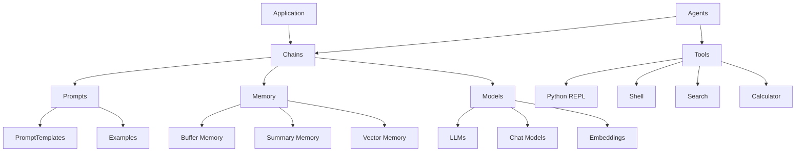
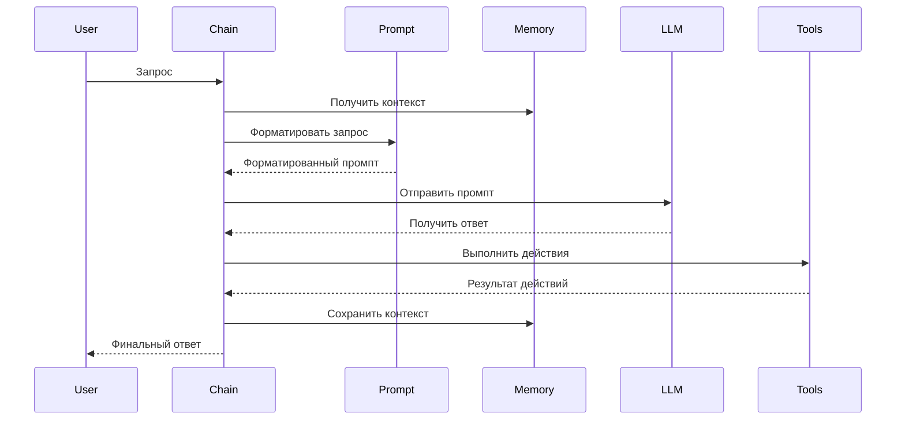
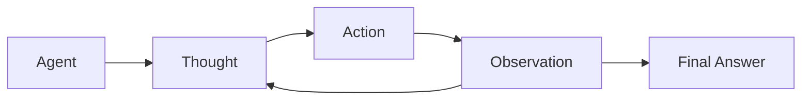

# LangChain Architecture

```mermaid
graph TD
    A[Application] --> B[Chains]
    B --> C[Prompts]
    B --> D[Memory]
    B --> E[Models]
    
    F[Agents] --> B
    F --> G[Tools]
    
    C --> H[PromptTemplates]
    C --> I[Examples]
    
    E --> J[LLMs]
    E --> K[Chat Models]
    E --> L[Embeddings]
    
    G --> M[Python REPL]
    G --> N[Shell]
    G --> O[Search]
    G --> P[Calculator]
    
    D --> Q[Buffer Memory]
    D --> R[Summary Memory]
    D --> S[Vector Memory]
```

## Процесс обработки запроса

```mermaid
sequenceDiagram
    participant User
    participant Chain
    participant Prompt
    participant Memory
    participant LLM
    participant Tools

    User->>Chain: Запрос
    Chain->>Memory: Получить контекст
    Chain->>Prompt: Форматировать запрос
    Prompt-->>Chain: Форматированный промпт
    Chain->>LLM: Отправить промпт
    LLM-->>Chain: Получить ответ
    Chain->>Tools: Выполнить действия
    Tools-->>Chain: Результат действий
    Chain->>Memory: Сохранить контекст
    Chain-->>User: Финальный ответ
```

## Структура агента

```mermaid
graph LR
    A[Agent] --> B[Thought]
    B --> C[Action]
    C --> D[Observation]
    D --> B
    D --> E[Final Answer]
```